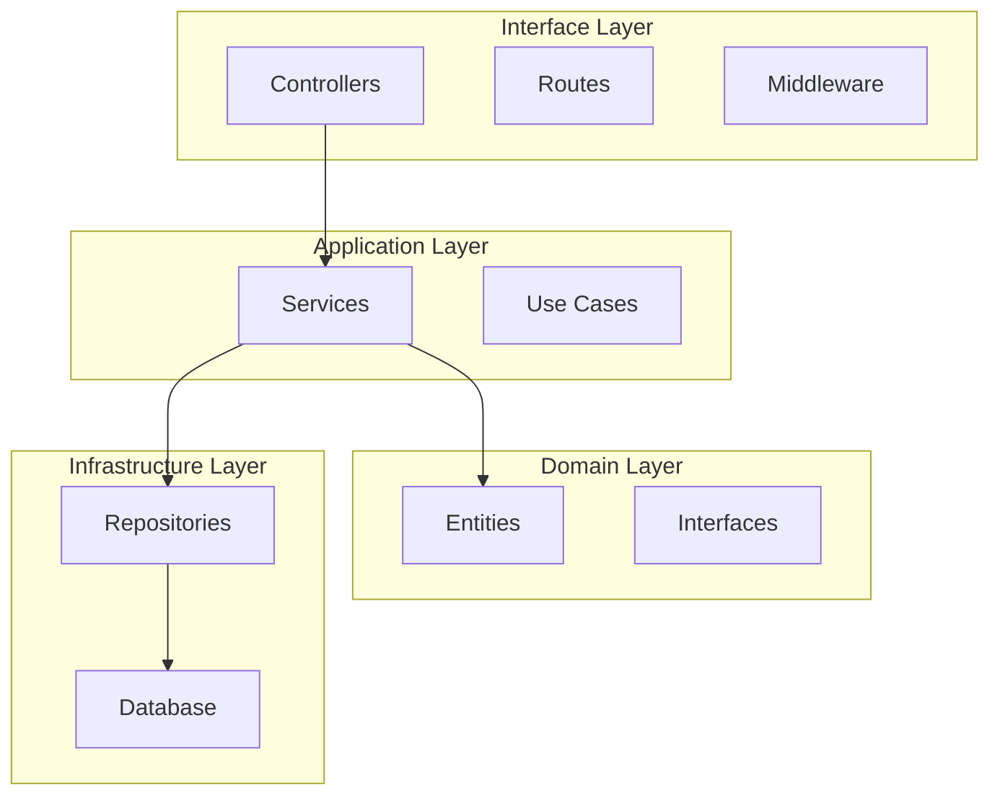

# CRM MindiMedia Documentation

Selamat datang di dokumentasi resmi **CRM MindiMedia** - sistem manajemen hotel multi-tenant dengan arsitektur Clean Architecture.

## 📚 Struktur Dokumentasi

### [01 - Overview](./01-overview/)
- [Introduction](./01-overview/intro.md) - Pengantar sistem CRM MindiMedia
- [Business Domain](./01-overview/business-domain.md) - Domain hotel management & multi-tenant
- [Technology Stack](./01-overview/technology-stack.md) - Tech stack & dependencies

### [02 - Architecture](./02-architecture/)
- [Clean Architecture](./02-architecture/clean-architecture.md) - Implementasi Clean Architecture dengan DI container
- Multi-Tenant Design - Desain isolasi data per hotel
- Database Schema - Entity relationships & migrations

### [03 - Security](./03-security/)
- [Authentication Flow](./03-security/authentication-flow.md) - Bearer token dengan rotation system
- RBAC System - Permission resolution algorithm  
- Security Features - Rate limiting, anomaly detection

### [04 - Business Features](./04-business-features/)
- Hotel Management - CRUD & ownership
- User Management - Users, roles, permissions
- Session Management - Auth sessions & audit trails

### [05 - Development](./05-development/)
- Getting Started - Setup & database seeding
- API Testing - Postman collection & test users
- Database Operations - Migrations, seeding, refresh

### [06 - API Reference](./06-api-reference/)
Auto-generated TypeScript API documentation dari source code.

## 🚀 Quick Start

```bash
# Clone repository
git clone [repository-url]
cd crm_mindimedia

# Install dependencies
npm install

# Setup environment
cp .env.example .env

# Run database migrations
npm run db:migrate

# Seed database dengan sample data
npm run db:seed

# Start development server
npm run dev
```

## 📊 Architecture Overview



## 🔐 Security Features

- **Bearer Token Authentication** dengan JWT
- **Token Rotation** untuk enhanced security
- **RBAC System** dengan hotel-scoped permissions
- **Rate Limiting** untuk brute-force protection
- **Session Management** dengan anomaly detection
- **PBKDF2 Password Hashing** dengan unique salt

## 💼 Business Entities

| Entity | Description | Scope |
|--------|-------------|-------|
| **Users** | System actors dengan berbagai roles | Global/Hotel |
| **Hotels** | Multi-tenant hotel entities | Isolated |
| **Roles** | Permission groups | Global/Hotel |
| **Permissions** | Granular access control | Resource-based |
| **Sessions** | Authentication sessions | User-specific |

## 🛠️ Development Scripts

```bash
# Database Operations
npm run db:migrate      # Run migrations
npm run db:rollback     # Rollback migration
npm run db:fresh        # Fresh database
npm run db:seed         # Seed data
npm run db:refresh      # Fresh + seed

# Documentation
npm run docs:typedoc    # Generate API docs
npm run docs:deps       # Generate dependency graph
npm run docs:build      # Build all docs
npm run docs:serve      # Serve docs locally
```

## 📝 Environment Variables

```env
# Application
NODE_ENV=development
PORT=3000

# Database
DB_HOST=localhost
DB_PORT=3306
DB_NAME=crm_mindimedia
DB_USER=root
DB_PASSWORD=password

# Security
JWT_SECRET=your-secret-key
JWT_EXPIRES_IN=15m
REFRESH_TOKEN_EXPIRES_IN=7d

# Rate Limiting
RATE_LIMIT_WINDOW=15m
RATE_LIMIT_MAX_ATTEMPTS=10
```

## 🧪 Testing

### Test Users (After Seeding)

| Email | Password | Role | Hotel |
|-------|----------|------|-------|
| superadmin@mindimedia.com | SuperAdmin123! | Super Admin | - |
| owner@hotel.com | OwnerPass123! | Hotel Owner | Hotel Indonesia |
| manager@hotel.com | ManagerPass123! | Hotel Manager | Hotel Indonesia |

### API Testing dengan Postman

1. Import collection dari `CRM_API_Complete.postman_collection.json`
2. Set environment variable `base_url` ke `http://localhost:3000`
3. Run "Login" request untuk mendapatkan tokens
4. Token otomatis tersimpan di environment untuk requests berikutnya

## 📞 Support & Contact

Untuk pertanyaan atau dukungan teknis:
- **Development Team**: MindiMedia & Guirez
- **Documentation**: [This Repository]
- **Issues**: [GitHub Issues]

---

*CRM MindiMedia - Enterprise Hotel Management System*  
*Version 0.0.1*
