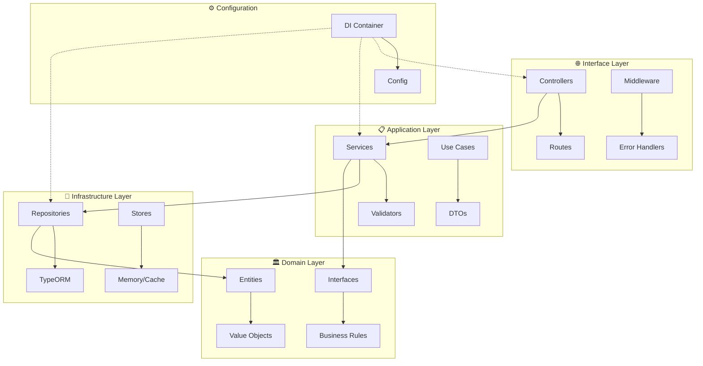
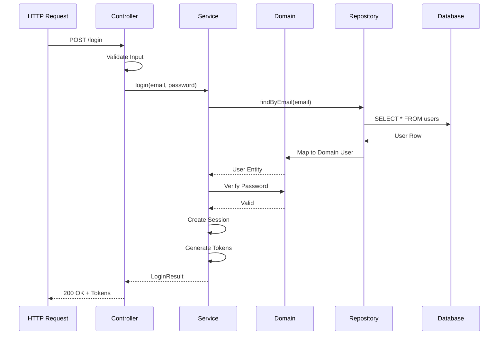

# Clean Architecture Implementation

## Architecture Overview

CRM MindiMedia mengimplementasikan Clean Architecture dengan prinsip **Dependency Inversion** dan **Separation of Concerns**. Arsitektur ini memastikan bahwa business logic tetap independen dari framework, database, dan detail implementasi eksternal.

## Layer Structure



## Layer Responsibilities

### 1. Domain Layer (Core Business)
**Location**: `src/domain/`

Lapisan paling dalam yang berisi business logic murni:

```typescript path=/Users/rezky/Documents/Work/intern_mindi/src/domain/auth/types.ts start=1
// Domain entities dan interfaces
export interface User {
  id: string;
  email: string;
  status: UserStatus;
  passwordHash: string;
  passwordSalt: string;
  roles: string[];
}

export interface Session {
  sessionId: string;
  userId: string;
  createdAt: Date;
  expiresAt: Date;
  lastActivity: Date;
}
```

**Karakteristik:**
- Tidak ada dependencies ke layer luar
- Pure TypeScript/JavaScript
- Business rules dan domain logic
- Domain events dan exceptions

**Components:**
- **Entities**: Core business objects (User, Hotel, Role)
- **Value Objects**: Immutable values (Email, Password)
- **Domain Services**: Business logic yang tidak fit di entity
- **Interfaces/Ports**: Contracts untuk external services

### 2. Application Layer (Use Cases)
**Location**: `src/services/`

Orchestration layer yang mengkoordinasi domain objects:

```typescript path=/Users/rezky/Documents/Work/intern_mindi/src/services/auth.service.ts start=47
export class AuthService {
  constructor(
    private userRepo: UserCredentialsRepository,
    private sessionStore: SessionStore,
    private tokenService: TokenService,
    private passwordService: PasswordService,
    private rateLimitService: RateLimitService
  ) {}

  async login(request: LoginRequest): Promise<LoginResult> {
    // 1. Rate limiting check
    // 2. User validation
    // 3. Password verification
    // 4. Session creation
    // 5. Token generation
    // Return result
  }
}
```

**Karakteristik:**
- Implements use cases
- Transaction boundaries
- Orchestrates domain objects
- Authorization checks

**Components:**
- **Services**: Use case implementations
- **DTOs**: Data transfer objects
- **Validators**: Input validation logic
- **Mappers**: Entity to DTO conversion

### 3. Interface Layer (Adapters)
**Location**: `src/controllers/`, `src/router/`

Handles external communication (HTTP, WebSocket, etc):

```typescript path=/Users/rezky/Documents/Work/intern_mindi/src/controllers/auth.controller.ts start=11
export class AuthController {
  constructor(private authService: AuthService) {}

  login = async (req: Request, res: Response): Promise<void> => {
    try {
      // Extract data from HTTP request
      const { email, password } = req.body;
      
      // Call application service
      const result = await this.authService.login({
        email,
        password,
        userAgent: req.get('User-Agent'),
        ipAddress: req.ip
      });
      
      // Return HTTP response
      res.status(200).json(createSuccessResponse(result));
    } catch (error) {
      // Handle errors
    }
  };
}
```

**Karakteristik:**
- HTTP request/response handling
- Input parsing dan validation
- Error translation
- Response formatting

**Components:**
- **Controllers**: HTTP request handlers
- **Routes**: URL to controller mapping
- **Middleware**: Cross-cutting concerns
- **Presenters**: Response formatting

### 4. Infrastructure Layer
**Location**: `src/repositories/`, `src/data/`

Technical implementations dan external service integrations:

```typescript path=/Users/rezky/Documents/Work/intern_mindi/src/repositories/user.repository.ts start=1
export class UserRepository implements UserCredentialsRepository {
  constructor(private db: DataSource) {}

  async findByEmail(email: string): Promise<User | null> {
    const result = await this.db
      .getRepository(UserEntity)
      .findOne({ where: { email } });
    
    return result ? this.mapToDomain(result) : null;
  }

  private mapToDomain(entity: UserEntity): User {
    // Map database entity to domain model
  }
}
```

**Karakteristik:**
- Database implementations
- External service adapters
- File system access
- Third-party integrations

**Components:**
- **Repositories**: Data access implementations
- **Stores**: Cache/session stores
- **Adapters**: External service wrappers
- **Migrations**: Database schema management

## Dependency Rules

### The Dependency Rule
Dependencies hanya boleh mengarah ke dalam (inward):

```
Controllers → Services → Domain ← Repositories
     ↓           ↓                      ↑
   HTTP      Use Cases              Database
```

### Forbidden Dependencies
```javascript
// ❌ WRONG: Domain depends on infrastructure
// src/domain/user.ts
import { TypeORMEntity } from 'typeorm'; // FORBIDDEN!

// ✅ CORRECT: Infrastructure depends on domain
// src/repositories/user.repository.ts
import { User } from '../domain/user'; // OK!
```

## Dependency Injection Container

### Container Configuration
**Location**: `src/config/dependencies.ts`

```typescript
export function createDependencyContainer() {
  // Infrastructure
  const dataSource = new DataSource(dbConfig);
  const sessionStore = new MemorySessionStore();
  const rateLimitStore = new MemoryRateLimitStore();
  
  // Repositories
  const userRepo = new UserRepository(dataSource);
  
  // Services
  const passwordService = new PasswordService();
  const tokenService = new TokenService(tokenStore);
  const authService = new AuthService(
    userRepo,
    sessionStore,
    tokenService,
    passwordService,
    rateLimitService
  );
  
  // Controllers
  const authController = new AuthController(authService);
  
  return {
    // Expose what's needed
    authController,
    authService,
    // ...
  };
}
```

### Benefits of DI
1. **Testability**: Easy to mock dependencies
2. **Flexibility**: Swap implementations easily
3. **Clarity**: Explicit dependencies
4. **Lifecycle Management**: Centralized instantiation

## Data Flow Example

### Login Flow Through Layers



## Testing Strategy

### Unit Tests by Layer

#### Domain Layer Tests
```typescript
describe('User Entity', () => {
  it('should validate email format', () => {
    expect(() => new User('invalid-email'))
      .toThrow('Invalid email format');
  });
});
```

#### Service Layer Tests
```typescript
describe('AuthService', () => {
  it('should authenticate valid user', async () => {
    const mockRepo = { findByEmail: jest.fn() };
    const service = new AuthService(mockRepo, ...);
    // Test implementation
  });
});
```

#### Controller Layer Tests
```typescript
describe('AuthController', () => {
  it('should return 200 on successful login', async () => {
    const mockService = { login: jest.fn() };
    const controller = new AuthController(mockService);
    // Test HTTP interaction
  });
});
```

### Integration Tests
```typescript
describe('Login Flow Integration', () => {
  it('should complete login flow end-to-end', async () => {
    // Test complete flow with real dependencies
  });
});
```

## Benefits of Clean Architecture

### 1. Independent of Frameworks
- Express dapat diganti dengan Fastify/Koa
- TypeORM dapat diganti dengan Prisma
- Business logic tetap unchanged

### 2. Testable
- Each layer dapat di-test independently
- Mock boundaries jelas
- High test coverage achievable

### 3. Independent of UI
- REST API dapat ditambah GraphQL
- WebSocket support tanpa change core
- Multiple interfaces possible

### 4. Independent of Database
- MySQL dapat diganti PostgreSQL
- NoSQL dapat ditambahkan
- Multi-database support

### 5. Independent of External Services
- JWT dapat diganti OAuth
- Memory store dapat diganti Redis
- Email service pluggable

## Common Patterns Used

### Repository Pattern
```typescript
interface UserRepository {
  findById(id: string): Promise<User | null>;
  findByEmail(email: string): Promise<User | null>;
  save(user: User): Promise<void>;
  delete(id: string): Promise<void>;
}
```

### Factory Pattern
```typescript
export function createAuthController(
  authService: AuthService
): AuthController {
  return new AuthController(authService);
}
```

### Strategy Pattern
```typescript
interface PasswordHasher {
  hash(password: string): Promise<string>;
  verify(password: string, hash: string): Promise<boolean>;
}

class PBKDF2Strategy implements PasswordHasher { }
class BcryptStrategy implements PasswordHasher { }
```

## Migration Path

### From Monolith to Clean Architecture
1. **Identify Boundaries**: Separate concerns
2. **Extract Domain**: Create pure domain models
3. **Define Interfaces**: Create ports/adapters
4. **Implement Services**: Extract use cases
5. **Refactor Controllers**: Thin controllers
6. **Setup DI**: Wire dependencies

### To Microservices
Clean Architecture makes microservices migration easier:
1. **Service Boundaries**: Already defined
2. **Domain Isolation**: Can be extracted
3. **Interface Contracts**: Become API contracts
4. **Independent Deployment**: Each service standalone

## Best Practices

### Do's ✅
- Keep domain layer pure
- Use dependency injection
- Program to interfaces
- Test each layer independently
- Keep controllers thin
- Use DTOs for data transfer

### Don'ts ❌
- Don't leak domain models to API
- Don't put business logic in controllers
- Don't make domain depend on infrastructure
- Don't bypass layers
- Don't share database transactions across layers
- Don't put validation only in UI

## Folder Structure Reference

```
src/
├── domain/              # Business logic & interfaces
│   ├── auth/
│   │   ├── types.ts    # Domain types
│   │   ├── ports.ts    # Interfaces
│   │   └── index.ts
│   └── entity.ts       # Base entity
│
├── services/           # Application services
│   ├── auth.service.ts
│   ├── token.service.ts
│   └── index.ts
│
├── controllers/        # HTTP controllers
│   ├── auth.controller.ts
│   ├── health.controller.ts
│   └── index.ts
│
├── repositories/       # Data access
│   ├── base.repository.ts
│   ├── user.repository.ts
│   └── typeorm/
│
├── core/              # Framework utilities
│   ├── http/
│   ├── middleware/
│   └── security/
│
└── config/            # Configuration
    ├── dependencies.ts
    ├── database.ts
    └── auth.ts
```

---

*Clean Architecture - The foundation of maintainable and scalable systems*
