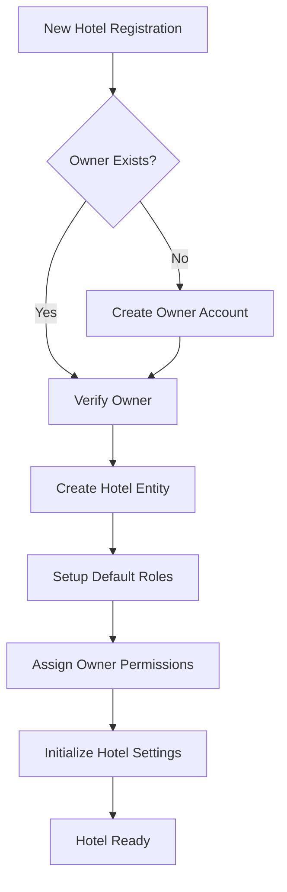
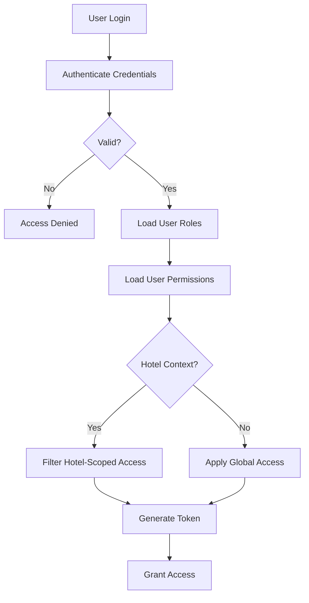
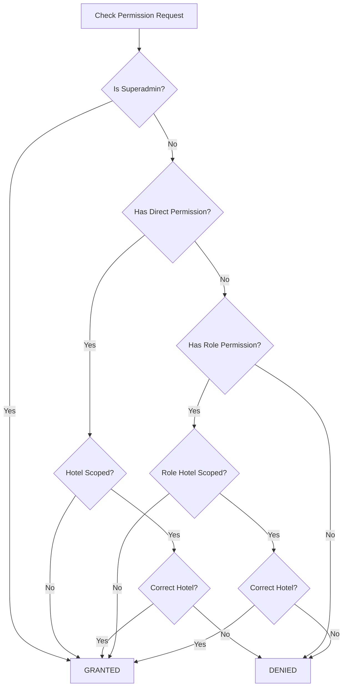

# Business Domain - Hotel Management CRM

## Domain Overview

CRM MindiMedia beroperasi dalam domain **Hotel Management** dengan fokus pada pengelolaan multi-tenant untuk jaringan hotel. Sistem ini dirancang untuk mengatasi kompleksitas operasional hotel modern yang memerlukan:

- Pengelolaan terpusat untuk multiple properties
- Isolasi data antar hotel untuk keamanan dan privasi
- Fleksibilitas dalam struktur organisasi dan permission
- Audit trail lengkap untuk compliance dan analisis

## Core Business Entities

### 1. Hotels (Multi-Tenant Core)

Hotel adalah entitas sentral dalam sistem multi-tenant kami:

```typescript
interface Hotel {
  id: bigint;
  owner_user_id: bigint;  // Pemilik hotel
  name: string;
  status: 'active' | 'suspended' | 'freeze';
  created_at: Date;
  updated_at: Date;
}
```

**Business Rules:**
- Setiap hotel memiliki satu owner (pemilik)
- Hotel dapat memiliki status active, suspended, atau freeze
- Data hotel completely isolated dari hotel lain
- Hotel owner memiliki akses penuh ke semua data hotel

### 2. Users (Actor System)

User adalah aktor dalam sistem dengan berbagai peran:

```typescript
interface User {
  id: bigint;
  email: string;
  name: string;
  status: 'active' | 'suspended' | 'freeze';
  email_verified_at?: Date;
  hotels?: Hotel[];  // Many-to-many via hotel_users
  roles?: Role[];    // Dynamic role assignment
}
```

**User Categories:**
- **Super Admin**: System-level administrator
- **Hotel Owner**: Pemilik satu atau lebih hotel
- **Hotel Manager**: Manager operasional hotel
- **Hotel Staff**: Staff dengan peran spesifik

### 3. Roles (Dynamic RBAC)

Role mendefinisikan sekumpulan permissions:

```typescript
interface Role {
  id: bigint;
  hotel_id?: bigint;  // NULL = global role
  name: string;
  slug: string;
  guard_name: string;
  permissions: Permission[];
}
```

**Role Types:**
- **Global Roles**: Berlaku across system (e.g., super-admin)
- **Hotel-Scoped Roles**: Berlaku dalam konteks hotel tertentu

### 4. Permissions (Granular Access Control)

Permission adalah unit terkecil dari access control:

```typescript
interface Permission {
  id: bigint;
  name: string;
  resource: string;  // e.g., 'hotels', 'users', 'roles'
  action: string;    // e.g., 'create', 'read', 'update', 'delete'
  guard_name: string;
}
```

### 5. Sessions & Tokens (Security Layer)

Manajemen session untuk tracking dan security:

```typescript
interface AuthSession {
  id: string;
  user_id: bigint;
  ip_address?: string;
  user_agent?: string;
  last_activity: Date;
  expires_at: Date;
  revoked_at?: Date;
  revoke_reason?: string;
}
```

## Business Processes

### Hotel Onboarding Flow



### User Access Flow



### Permission Resolution Algorithm



## Value Streams

### 1. Multi-Property Management
**Value Proposition**: Centralized management for hotel chains
- Single dashboard untuk multiple properties
- Consolidated reporting dan analytics
- Standardized operations across properties
- Cost reduction melalui shared infrastructure

### 2. Security & Compliance
**Value Proposition**: Enterprise-grade security dengan audit trail
- Complete activity logging
- Role-based access control
- Data isolation per hotel
- Compliance dengan regulasi privasi

### 3. Operational Efficiency
**Value Proposition**: Streamlined hotel operations
- Automated permission management
- Quick onboarding untuk staff baru
- Flexible role configuration
- Reduced administrative overhead

### 4. Scalability
**Value Proposition**: Grow tanpa batas
- Add unlimited hotels
- Scale users per hotel independently
- Performance tidak terpengaruh jumlah tenant
- Modular architecture untuk feature expansion

## Domain-Driven Design Concepts

### Bounded Contexts

1. **Authentication Context**
   - User credentials
   - Session management
   - Token handling
   
2. **Authorization Context**
   - Roles & Permissions
   - Access control
   - Permission resolution

3. **Hotel Management Context**
   - Hotel entities
   - Hotel-user relationships
   - Hotel settings

4. **Audit Context**
   - Activity logging
   - Change tracking
   - Compliance reporting

### Aggregates

- **User Aggregate**: User + Credentials + Sessions
- **Hotel Aggregate**: Hotel + Settings + Members
- **Access Control Aggregate**: Role + Permissions + Assignments

### Domain Events

- `UserRegistered`
- `HotelCreated`
- `RoleAssigned`
- `PermissionGranted`
- `SessionCreated`
- `TokenRefreshed`
- `AccessDenied`

## Business Constraints

1. **Data Isolation**: Hotel data must never leak across tenants
2. **Owner Authority**: Hotel owner has ultimate authority over their hotels
3. **Permission Hierarchy**: Global permissions override hotel-scoped
4. **Session Security**: Expired sessions must be immediately invalid
5. **Audit Completeness**: All state changes must be logged

## Success Metrics

### Technical Metrics
- API Response Time < 200ms (p95)
- Token Validation < 50ms
- Database Query Time < 100ms
- System Uptime > 99.9%

### Business Metrics
- User Onboarding Time < 5 minutes
- Permission Resolution Accuracy = 100%
- Audit Trail Completeness = 100%
- Cross-tenant Data Leakage = 0

### Usage Metrics
- Active Hotels
- Daily Active Users
- API Calls per Day
- Concurrent Sessions

## Future Expansion Opportunities

1. **Guest Management Module**
   - Guest profiles and preferences
   - Booking history
   - Loyalty programs

2. **Revenue Management**
   - Room pricing optimization
   - Revenue analytics
   - Forecasting

3. **Channel Integration**
   - OTA connectivity
   - Channel manager
   - Rate parity management

4. **Business Intelligence**
   - Advanced analytics
   - Custom dashboards
   - Predictive insights

---

*CRM MindiMedia - Empowering Hotel Management Through Technology*
